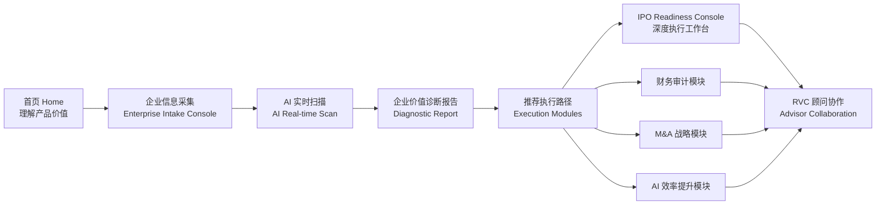

# RVC Enterprise Value Diagnostic Platform  
## Vibe Coding UI Build Specification  
### React + Tailwind CSS + Framer Motion + Three.js / Spline + SVG / CSS Animation

> Version: Investor-ready UI Spec  
> Brand: RVC / Real Value Capital  
> Product: AI 驱动的企业价值诊断与资本路径执行平台  
> Design Direction: Palantir-inspired clarity + Apple-style Liquid Glass + RVC blue brand system  
> Primary Goal: 让开发者可直接用本文件进行 vibe coding，生成高保真 Web UI 原型。

---

# 0. Product Summary / 产品一句话

**RVC Enterprise Value Diagnostic Platform** 是一个面向企业客户的 AI 企业价值体检与资本路径执行平台。用户通过填写企业信息、上传财务/业务/股权资料，平台生成企业价值诊断报告，并进一步将客户分流到 IPO 法务、财务审计、M&A 战略、AI 效率提升、资本市场叙事、投资人匹配等执行模块，最终由 RVC 顾问团队介入推进项目落地。

核心体验路径：



---

# 1. Tech Stack / 推荐前端技术栈

## 1.1 Core

Use:

- **React 18+ / Next.js 14+ App Router**
- **TypeScript**
- **Tailwind CSS**
- **Framer Motion**
- **shadcn/ui** for base components
- **lucide-react** for icons
- **Recharts** for radar chart / line chart / progress visualization
- **Three.js / React Three Fiber** or **Spline** for hero 3D glass asset
- **SVG + CSS animations** for lines, arrows, glowing nodes
- **Zustand** or **Jotai** for lightweight state
- **React Hook Form + Zod** for forms
- **TanStack Table** for checklist tables
- **FilePond / Uppy** for drag-and-drop uploads

## 1.2 Suggested Directory Structure

```txt
src/
  app/
    page.tsx
    diagnostic/page.tsx
    scan/page.tsx
    report/page.tsx
    modules/page.tsx
    ipo-readiness/page.tsx
  components/
    layout/
      TopNav.tsx
      Sidebar.tsx
      PageShell.tsx
    brand/
      RVCLogo.tsx
      BrandMark.tsx
    glass/
      LiquidGlassCard.tsx
      GlassButton.tsx
      GlassInput.tsx
      GlassPanel.tsx
    charts/
      ScoreGauge.tsx
      RadarChartCard.tsx
      ProgressTimeline.tsx
    motion/
      AnimatedFlowLines.tsx
      FloatingGlassOrb.tsx
      ScanEngine.tsx
    modules/
      ExecutionModuleCard.tsx
      ServicePathCard.tsx
      RiskList.tsx
      ChecklistTable.tsx
    forms/
      IntakeStepNav.tsx
      CompanyInfoForm.tsx
      UploadVault.tsx
  lib/
    constants.ts
    designTokens.ts
    mockData.ts
  styles/
    globals.css
```

---

# 2. Design Language / 设计语言总纲

## 2.1 Overall Aesthetic

整体视觉必须是：

- **浅色背景为主**
- **RVC Logo 蓝作为主强调色**
- **黑色/深海军蓝作为文字主色**
- **Apple Liquid Glass 质感，但不要过度**
- **Palantir 风格的信息秩序、留白、理性、企业级信任感**
- **清晰、克制、高级、投资人汇报级别**

关键词：

```txt
Clean / Institutional / Intelligent / Calm / Premium / Liquid Glass / Operational Console
```

不要做成：

- 传统投行蓝色 PPT 风
- 过度赛博朋克
- 过多紫色渐变
- 过度发光导致字体看不清
- 图标风格混乱
- 字号过小、信息密集

---

# 3. Brand System / 品牌系统

## 3.1 Logo

左上角固定放置 RVC Logo。

Header logo layout:

```txt
[RVC Logo]  |  ENTERPRISE VALUE
              DIAGNOSTIC PLATFORM
```

Logo 与文字的间距要大，整体高级、清晰。

## 3.2 Color Tokens

以 RVC Logo 蓝为主色，替换之前偏紫色的配色。

```ts
export const colors = {
  background: {
    page: "#F7FAFF",
    pageWarm: "#FBFCFF",
    panel: "rgba(255,255,255,0.78)",
    panelStrong: "rgba(255,255,255,0.92)",
  },
  text: {
    primary: "#07132B",
    secondary: "#42526E",
    muted: "#6B7890",
    faint: "#9AA6B8",
  },
  brand: {
    blue: "#0B6FFB",
    blueDeep: "#004DD9",
    blueSoft: "#E8F2FF",
    cyan: "#23B7FF",
    navy: "#07132B",
  },
  border: {
    light: "rgba(11,111,251,0.16)",
    medium: "rgba(11,111,251,0.28)",
    strong: "rgba(11,111,251,0.42)",
  },
  state: {
    success: "#16B364",
    warning: "#F59E0B",
    danger: "#F04438",
    info: "#0B6FFB",
  },
  glass: {
    highlight: "rgba(255,255,255,0.86)",
    innerShadow: "rgba(11,111,251,0.08)",
    glow: "rgba(11,111,251,0.18)",
  }
}
```

## 3.3 Gradient Rules

Main CTA:

```css
background: linear-gradient(135deg, #0B6FFB 0%, #005BEA 55%, #23B7FF 100%);
box-shadow: 0 16px 36px rgba(11,111,251,.28), inset 0 1px 1px rgba(255,255,255,.45);
```

Text gradient only for small highlights, not main body:

```css
background: linear-gradient(90deg, #0B6FFB, #23B7FF);
-webkit-background-clip: text;
color: transparent;
```

Avoid purple gradients. If needed, use only a tiny spectral edge inside glass reflections.

---

# 4. Typography / 字体系统

## 4.1 Font Family

Recommended:

```css
font-family:
  Inter,
  "SF Pro Display",
  "SF Pro Text",
  "PingFang SC",
  "Microsoft YaHei",
  system-ui,
  sans-serif;
```

## 4.2 Typography Scale

Use larger, clearer typography. Investor presentation must be readable.

```ts
const typography = {
  nav: "text-[16px] font-medium tracking-[-0.01em]",
  eyebrow: "text-[16px] uppercase tracking-[0.08em] font-semibold text-brand-blue",
  heroTitle: "text-[64px] leading-[1.05] font-semibold tracking-[-0.045em]",
  pageTitle: "text-[44px] leading-[1.12] font-semibold tracking-[-0.035em]",
  sectionTitle: "text-[28px] leading-[1.2] font-semibold tracking-[-0.02em]",
  cardTitle: "text-[21px] leading-[1.25] font-semibold",
  body: "text-[16px] leading-[1.65] text-slate-700",
  bodySmall: "text-[14px] leading-[1.55] text-slate-600",
  metric: "text-[54px] leading-none font-semibold tracking-[-0.045em]",
  metricSmall: "text-[34px] leading-none font-semibold tracking-[-0.03em]",
}
```

## 4.3 Text Color Rules

- Main titles: `#07132B`
- Secondary descriptions: `#42526E`
- Labels: `#6B7890`
- Links and active state: `#0B6FFB`
- Success / warning / risk only used for status, not decoration

---

# 5. Liquid Glass Component System

## 5.1 Core Glass Card

Use light liquid glass, but controlled.

```tsx
<div className="
  rounded-[28px]
  border border-blue-500/15
  bg-white/70
  backdrop-blur-2xl
  shadow-[0_20px_60px_rgba(15,45,90,0.08)]
  ring-1 ring-white/70
  relative overflow-hidden
">
  <div className="pointer-events-none absolute inset-0 bg-[radial-gradient(circle_at_20%_0%,rgba(255,255,255,0.9),transparent_35%),linear-gradient(135deg,rgba(11,111,251,0.06),transparent_45%)]" />
  <div className="relative z-10">...</div>
</div>
```

## 5.2 Glass Intensity

Use three levels:

### Level 1: subtle card
For most dashboard cards.

```css
bg-white/72 backdrop-blur-xl border-blue-500/12 shadow-sm
```

### Level 2: highlighted card
For selected states and CTA modules.

```css
bg-white/78 backdrop-blur-2xl border-blue-500/24 shadow-[0_18px_48px_rgba(11,111,251,.13)]
```

### Level 3: hero glass object
For central AI engine only.

```css
bg-white/55 backdrop-blur-[32px] border-white/80 shadow-[0_30px_80px_rgba(11,111,251,.22)]
```

Do not apply heavy rainbow glass to every card. It should appear only on hero engine, selected nav, and major score cards.

## 5.3 Apple-style Border Highlight

```css
.glass-card::before {
  content: "";
  position: absolute;
  inset: 0;
  border-radius: inherit;
  padding: 1px;
  background: linear-gradient(135deg, rgba(255,255,255,.9), rgba(11,111,251,.22), rgba(255,255,255,.5));
  mask: linear-gradient(#000 0 0) content-box, linear-gradient(#000 0 0);
  mask-composite: exclude;
  pointer-events: none;
}
```

---

# 6. Icon System / 图标风格

## 6.1 Icon Direction

Use:

- lucide-react outline icons for UI
- custom 3D translucent blue icons for large module cards
- consistent stroke width: 1.8–2.2px
- color: RVC blue `#0B6FFB`

Do not mix filled emoji-style icons with outline icons in the same card.

## 6.2 Icon Mapping

```ts
import {
  Building2,
  Landmark,
  PieChart,
  Handshake,
  TrendingUp,
  Users,
  FileText,
  ShieldCheck,
  AlertTriangle,
  BarChart3,
  Network,
  Database,
  UploadCloud,
  Sparkles,
  CalendarClock,
  ClipboardCheck,
  Target,
  Globe2,
  Bot,
  Workflow,
  Download,
  Share2,
  ChevronRight,
  ArrowRight,
} from "lucide-react";
```

## 6.3 Main Service Icons

| Module | Icon |
|---|---|
| IPO 法务 | Landmark |
| 财务审计 | PieChart |
| M&A 战略 | Handshake |
| AI 效率提升 | TrendingUp / Workflow |
| 资本市场叙事 | FileText |
| 投资人匹配 | Users |
| 风险评估 | AlertTriangle |
| 数据室 | Database |
| 顾问协作 | ShieldCheck / Users |

Large icons should sit inside glass orbs:

```tsx
<div className="h-16 w-16 rounded-2xl bg-white/70 border border-blue-500/20 shadow-[inset_0_1px_0_rgba(255,255,255,.8),0_14px_30px_rgba(11,111,251,.12)] flex items-center justify-center">
  <Landmark className="h-9 w-9 text-[#0B6FFB]" strokeWidth={1.9} />
</div>
```

---

# 7. Global Layout / 全局布局

## 7.1 Header

Height: 108px desktop, 76px compact.

```txt
| RVC Logo + Product Name | Platform | Solutions | Diagnostic | Reports | Modules | Advisors | Login | Demo |
```

Header style:

- white / glass
- thin bottom border
- sticky top
- active nav as soft glass pill
- CTA button: outline glass or solid blue depending page

```tsx
<header className="
  sticky top-0 z-50
  h-[92px]
  bg-white/76 backdrop-blur-2xl
  border-b border-blue-500/10
">
```

## 7.2 Page Width

Use wide enterprise dashboard layout.

```css
max-width: 1920px;
padding-left: 48px;
padding-right: 48px;
```

For 16:9 UI mockup:

```txt
Canvas: 1920 × 1080 or 1680 × 945
```

## 7.3 Grid System

Use 12-column grid.

```tsx
<div className="grid grid-cols-12 gap-5">
```

Spacing:

- page x padding: 48–64px
- card padding: 24–32px
- card gap: 20–28px
- section gap: 36–56px

---

# 8. Page 1 — Home / AI-Driven Value Growth

## 8.1 Purpose

首页负责建立平台定位和客户信任。客户应该 10 秒理解：

1. RVC 用 AI 做企业价值体检  
2. 体检后生成资本市场报告  
3. 报告会分流到 IPO / 财务审计 / M&A / AI 效率提升等执行路径  
4. RVC 顾问会继续介入落地

## 8.2 Layout

```txt
Header
└── Hero Section
    ├── Left: big value proposition + CTA + feature chips
    └── Right: value diagnostic engine flow diagram
└── Horizontal Process Strip
└── Service Module Cards
└── KPI Metrics Strip
```

## 8.3 Copy

Eyebrow:

```txt
AI-DRIVEN VALUE GROWTH
```

Hero title:

```txt
AI 驱动企业价值增长
```

Subtitle:

```txt
从企业体检到资本路径执行，AI 与顾问协同推进价值提升
From Enterprise Diagnostic to Capital-Market Execution.
```

Buttons:

```txt
开始企业体检 →
查看报告样例 ✦
```

Feature chips:

```txt
全局诊断
360° 企业健康评估

AI 洞察
多维度数据分析

路径落地
从洞察到执行闭环
```

Process steps:

```txt
01 企业信息上传
02 AI 分析
03 体检报告
04 执行模块
05 顾问协作
```

Service Cards:

```txt
IPO 业务
上市合规与法律顾问服务，提升资本市场效率

财务审计
财务健康度评估与审计建议，增强投资人信心

M&A 战略
并购机会识别与交易执行支持，创造协同价值

AI 效率提升
流程优化与智能化提升方案，提高组织效能
```

Metrics:

```txt
2,486+ 企业已完成体检
186+ 行业覆盖
320+ 认证顾问
68% 项目落地率
$42B+ 累计预估价值增长
```

## 8.4 Visual Details

- Hero background: soft white to light blue gradient
- Right diagram: central RVC Value Diagnostic Engine card
- Data inputs on left, smart outputs on right
- Blue dotted SVG connector lines
- Bottom collaboration strip

## 8.5 Motion

Use Framer Motion:

```ts
initial={{ opacity: 0, y: 24 }}
animate={{ opacity: 1, y: 0 }}
transition={{ duration: 0.7, ease: [0.22, 1, 0.36, 1] }}
```

Use animated SVG lines:

```css
stroke-dasharray: 6 8;
animation: dash 18s linear infinite;

@keyframes dash {
  to { stroke-dashoffset: -240; }
}
```

Hero glass engine subtle float:

```ts
animate={{ y: [0, -8, 0] }}
transition={{ duration: 6, repeat: Infinity, ease: "easeInOut" }}
```

---

# 9. Page 2 — Enterprise Intake Console

## 9.1 Purpose

将普通“信息采集表”升级为企业级尽调控制台。用户在这里填写企业资料，同时右侧 AI 面板即时显示扫描结果、进度和初步洞察。

## 9.2 Layout

```txt
Header
└── 3-column dashboard
    ├── Left: step navigation + estimated completion card
    ├── Center: active form panel
    └── Right: AI real-time scan + signals + early insights
```

Column widths:

```txt
Left: 22%
Center: 54%
Right: 24%
```

## 9.3 Left Step Navigation

Title:

```txt
ENTERPRISE INTAKE CONSOLE
企业价值诊断 · 信息采集
Enterprise Intake Console
```

Steps:

```txt
01 企业基本信息 / Basic Information
02 业务与收入模型 / Business & Revenue Model
03 财务与审计资料 / Financials & Audit Data
04 股权与融资结构 / Equity & Financing
05 战略目标 / Strategic Objectives
06 文件上传 / Document Upload
07 提交与生成报告 / Submit & Generate Report
```

Active step style:

- blue filled circle
- glass pill background
- right chevron

Estimated completion card:

```txt
预计完成时间
Estimated Completion

18–25 分钟
minutes
```

## 9.4 Center Form Panel

Header:

```txt
01 企业基本信息
Basic Information
```

Required pill:

```txt
必填
```

Instruction:

```txt
请填写企业基本信息，所有信息将受到严格保密保护。
Please provide basic company information. All data is encrypted and strictly confidential.
```

Sections:

```txt
企业概况 / Company Overview
企业性质 / Company Details
联系人信息 / Contact Information
```

Fields:

```txt
企业名称 / Company Name
企业简称 / Company Short Name
成立时间 / Founded Date
企业总部 / Headquarters
企业网站 / Website
企业类型 / Company Type
行业分类 / Industry Classification
员工规模 / Employee Count
年收入区间 / Annual Revenue Range
主要市场 / Primary Markets
联系人姓名 / Contact Name
职位 / Job Title
邮箱 / Email
手机号 / Phone Number
```

Buttons:

```txt
保存草稿 / Save Draft
下一步：业务与收入模型 / Next: Business & Revenue Model →
```

## 9.5 Right AI Scan Panel

Title:

```txt
AI 实时扫描
AI Real-time Scan
```

Progress:

```txt
14% 已完成
1/7 Step Progress
```

AI signals:

```txt
企业治理健全性 / Public Completeness — 良好 Good
数据完整度 / Data Sufficiency — 中等 Medium
合规风险识别 / Compliance Risk — 低风险 Low Risk
```

Early Insights:

```txt
行业对比 - 估值倍数（中位数）
¥28.6亿 RMB

收入增长潜力
中等 Medium

资本市场关注度
较高 High
```

Final reminder:

```txt
完成所有步骤后，AI 将生成深度诊断报告
Complete all steps to generate your full diagnostic report.
```

## 9.6 Interaction Rules

- Clicking step updates center form.
- Completed steps become blue check state.
- Form validation uses subtle red outline and small helper text.
- Save Draft saves local state.
- Next button should require required fields.
- AI scan panel updates with progress and signal statuses.

---

# 10. Page 3 — Enterprise Value Diagnostic Report

## 10.1 Purpose

报告页是产品核心。它要看起来像专业咨询报告 + SaaS Dashboard，而不是普通 PDF。客户在这里看到企业当前价值状态、风险、机会，并被推荐进入执行路径。

## 10.2 Layout

```txt
Header
└── Left Sidebar: report sections
└── Main Content:
    ├── Title row + action buttons
    ├── Score card + radar card + recommended paths
    ├── Advisor summary + opportunities + risks
    └── 30/60/90/180-day roadmap
```

## 10.3 Sidebar Items

```txt
报告概览
企业概况
价值评估
能力分析
财务健康度
市场与竞争
风险评估
机会分析
建议与路径
附录
```

Bottom CTA:

```txt
联系我们
```

## 10.4 Main Header

Title:

```txt
企业价值诊断报告
Enterprise Value Diagnostic Report
```

Actions:

```txt
下载报告
分享报告
报告日期：2025-05-20
```

## 10.5 Score Card

Title:

```txt
Enterprise Value Readiness Score
```

Metric:

```txt
72 / 100
```

Status:

```txt
良好
```

Description:

```txt
您的企业已具备良好的价值提升基础，仍有关键领域可进一步优化。
```

Sub-metrics:

```txt
百分位排名：前 28%
行业对标：领先
评估维度：6 大维度
数据来源：28 项数据
```

## 10.6 Radar Chart Card

Dimensions:

```txt
战略与增长 78
财务健康 72
运营效率 65
治理与合规 70
组织与人才 68
技术与数据 75
```

Use Recharts RadarChart:

```tsx
<RadarChart outerRadius={115} data={data}>
  <PolarGrid />
  <PolarAngleAxis dataKey="subject" />
  <Radar name="Your Company" dataKey="score" stroke="#0B6FFB" fill="#0B6FFB" fillOpacity={0.12} />
  <Radar name="Industry Median" dataKey="median" stroke="#8CA7D7" strokeDasharray="4 4" fill="transparent" />
</RadarChart>
```

## 10.7 Recommended Paths

```txt
IPO 走势
上市路径与关键资料规划
优先级：高

财务审计
财务健康度评估与审计建议
优先级：高

M&A 战略
并购机会识别与交易执行支持
优先级：中

AI 效率提升
AI 应用优化与流程自动化转型
优先级：中

资本市场叙事
投资者沟通与价值叙事构建
优先级：中
```

## 10.8 Summary Cards

AI + Advisor Summary:

```txt
企业具备较强的增长潜力与转型动能
技术与数据能力处于行业领先水平
运营效率仍有进一步优化空间
建议聚焦高收益领域与长期能力
```

Key Opportunities:

```txt
海外市场拓展潜力：预期价值提升 12–18%
产品组合优化：预期价值提升 8–12%
AI 驱动效率提升：预期价值提升 10–15%
```

Key Risks:

```txt
全球供应链波动：高影响
市场竞争加剧：中等影响
关键人才流失风险：中等影响
```

## 10.9 Roadmap

```txt
30天：夯实基础
- 完成财务健康度深度评估
- 梳理核心流程与问题源
- 建立短期绩效指标 KPI

60天：优化提升
- 优化关键业务流程
- 推进重点项目落地
- 启动 AI 应用试点项目

90天：价值释放
- 实现运营效率显著提升
- 完善数据驱动决策体系
- 构建投资者沟通材料

180天+：价值跃升
- 实现可持续增长模式
- 提升市场认可度与估值
- 准备资本市场融资与上市
```

---

# 11. Page 4 — Recommended Execution Paths

## 11.1 Purpose

将报告结果转化为服务路径选择。这个页面必须非常清晰地显示各模块的优先级、匹配度、周期和价值。

## 11.2 Layout

```txt
Header
└── Page title and description
└── Priority filters
└── Six execution module cards
└── Bottom metrics strip
```

## 11.3 Title

```txt
Recommended Execution Paths / 推荐执行路径
```

Subtitle:

```txt
基于企业诊断结果与价值增长目标，我们为您推荐最优执行路径与模块组合，助力从洞察到绩效的闭环落地。
From insight to execution. Select the modules that fit your priorities and unlock measurable impact.
```

## 11.4 Priority Filters

```txt
高优先级 / High Priority
快速见效，强影响力

中优先级 / Medium Priority
价值显著，稳步推进

低优先级 / Low Priority
长期价值，持续优化
```

## 11.5 Module Cards

Each card includes:

- 3D liquid blue icon
- title
- match score pill
- description
- duration
- priority
- expected match / value
- CTA

### IPO 法务

```txt
匹配度 96%
全面梳理上市合规路径，防范法务风险，提升信息披露质量。
周期：8–12 周
优先级：高
预期匹配度：92%
查看路径 →
```

### 财务审计

```txt
匹配度 94%
优化财务治理与内控体系，提升审计效率与资本信心。
周期：6–10 周
优先级：高
预期匹配度：89%
查看路径 →
```

### M&A 战略

```txt
匹配度 91%
识别并评估并购机会，构建协同价值与整合落地路径。
周期：10–16 周
优先级：中
预期匹配度：85%
查看路径 →
```

### AI 效率提升

```txt
匹配度 89%
识别高价值自动化场景，提升运营效率与组织生产力。
周期：6–12 周
优先级：中
预期匹配度：82%
查看路径 →
```

### 资本市场叙事

```txt
匹配度 87%
构建差异化资本市场故事，增强投资人沟通与估值认同。
周期：4–8 周
优先级：中
预期匹配度：76%
查看路径 →
```

### 投资人匹配

```txt
匹配度 84%
精准匹配潜在投资人，提升融资效率与合作有效性。
周期：4–6 周
优先级：低
预期匹配度：75%
查看路径 →
```

## 11.6 Bottom Metrics

```txt
6 推荐模块数
92% 平均路径匹配度
8–16 周 平均执行周期
高 整体执行优先级
3 协同模块组合
$42B+ 预估价值提升
```

---

# 12. Page 5 — IPO Readiness Console

## 12.1 Purpose

IPO 模块深度工作台，用于展示上市准备度、关键任务、风险、时间线和顾问动作。

## 12.2 Layout

```txt
Header
└── Left Sidebar
└── Main:
    ├── Breadcrumb + title
    ├── Readiness score + IPO timeline
    ├── Checklist table + Risk panel
    └── Bottom action cards
```

## 12.3 Sidebar

```txt
IPO 读势服务
IPO Readiness Console

IPO 总览
IPO Checklist
风险矩阵
上市路线图
文件清单
顾问建议

顾问卡片：
您的专属顾问
王顾问
资本市场与合规专家
联系按钮
```

## 12.4 Page Header

```txt
IPO 读势服务 / IPO Readiness Console
IPO Readiness Console
全面评估上市准备状态，识别风险与差距，找到最佳上市路径。
```

## 12.5 Score Card

```txt
IPO Readiness
55 / 100

准备状态：中等
预计上市时间：12–18 个月
最近更新：2025-05-20
```

## 12.6 IPO Path Timeline

```txt
1 锁定准备 — 进行中
2 审计启动 — 未开始
3 提交 SEC — 未开始
4 SEC 审核 — 未开始
5 路演定价 — 未开始
6 IPO 上市 — 未开始
```

Use horizontal SVG timeline with circular icon nodes.

## 12.7 Checklist Table

Columns:

```txt
类别 | 任务 | 负责人 | 进度 | 状态 | 截止日期
```

Rows:

```txt
财务与审计 | 完成最近 3 年财务报表审计 | 财务部 | 75% | 进行中 | 2025-06-15
公司治理 | 完善董事会治理架构与委员会 | 法务部 | 60% | 进行中 | 2025-06-30
合规与控股 | SOX 内控评估与差距整改 | 内控部 | 40% | 进行中 | 2025-07-15
法律文件 | 更新公司章程及股东协议 | 法务部 | 80% | 进行中 | 2025-05-30
信息披露 | 准备招股说明书初稿 | 资本市场部 | 30% | 未开始 | 2025-07-31
业务与运营 | 关键业务流程与 KPI 梳理 | 战略部 | 50% | 进行中 | 2025-06-20
```

## 12.8 Risk Panel

```txt
财务报告合规风险 — 高
收入确认与费用分类存在不一致风险

内控控制薄弱 — 中
IT 一般控制与权限管理需加强

关联交易披露不足 — 中
关联方交易的披露完整性需提升

知识产权风险 — 低
部分专利文件尚未完成境外备案

数据隐私合规 — 低
需完善全球数据隐私政策与披露
```

## 12.9 Bottom Actions

```txt
生成 IPO 清单
基于企业数据自动生成定制化清单

预约顾问会议
与资本市场专家一对一咨询

查看时间表
获取完整上市路径时间表
```

---

# 13. Motion / Animation System

## 13.1 Animation Principles

Animations should be:

- slow
- premium
- subtle
- functional
- not distracting

## 13.2 Page Transitions

```tsx
<motion.main
  initial={{ opacity: 0, y: 18, filter: "blur(6px)" }}
  animate={{ opacity: 1, y: 0, filter: "blur(0px)" }}
  exit={{ opacity: 0, y: -12, filter: "blur(6px)" }}
  transition={{ duration: 0.45, ease: [0.22, 1, 0.36, 1] }}
>
```

## 13.3 Card Hover

```tsx
whileHover={{
  y: -4,
  scale: 1.01,
  boxShadow: "0 24px 70px rgba(11,111,251,.14)"
}}
transition={{ duration: 0.25 }}
```

## 13.4 Glass Reflection Animation

```css
.glass-shine {
  position: absolute;
  inset: -40%;
  background: linear-gradient(
    120deg,
    transparent 35%,
    rgba(255,255,255,.42) 50%,
    transparent 65%
  );
  transform: translateX(-70%) rotate(12deg);
  animation: shine 7s ease-in-out infinite;
}

@keyframes shine {
  0%, 70% { transform: translateX(-70%) rotate(12deg); opacity: 0; }
  78% { opacity: .8; }
  100% { transform: translateX(70%) rotate(12deg); opacity: 0; }
}
```

Use only on CTA buttons, active nav, and hero engine.

## 13.5 SVG Data Flow Animation

```tsx
<svg>
  <path
    d="M0 0 C 120 0, 120 80, 260 80"
    stroke="#0B6FFB"
    strokeWidth="2"
    strokeDasharray="5 8"
    fill="none"
    className="animate-dash"
  />
</svg>
```

```css
.animate-dash {
  animation: dashMove 16s linear infinite;
}
@keyframes dashMove {
  to { stroke-dashoffset: -220; }
}
```

---

# 14. WebGL / Three.js / Spline Suggestions

## 14.1 Home Hero 3D Asset

Use Spline or React Three Fiber to create:

```txt
A translucent liquid glass cube / rounded square object
Inside text: RVC
Below: Value Diagnostic Engine
Data particles flow from left input nodes to center and from center to right output nodes.
```

Material:

```ts
transmission: 0.82
roughness: 0.12
metalness: 0.0
ior: 1.45
thickness: 0.65
clearcoat: 1
clearcoatRoughness: 0.05
```

Light:

```txt
Key light: soft white
Rim light: RVC blue
Ambient: cool blue-gray
```

## 14.2 Module 3D Icons

Use Spline or custom GLB icons:

- Landmark for IPO
- Pie chart for audit
- handshake for M&A
- line chart for AI productivity
- document stack for capital story
- user orb for investor matching

All should be translucent blue glass with white highlights.

---

# 15. Responsive Behavior

## 15.1 Desktop First

Main target: 1440px to 1920px wide.

## 15.2 Tablet

- Collapse sidebars into top tabs
- Keep report cards in 2-column grid
- Timeline becomes horizontal scroll

## 15.3 Mobile

- Header becomes simplified
- Left nav becomes bottom drawer
- Hero diagram becomes stacked
- Report score and recommended path cards stack vertically
- Upload and form fields full width
- Keep CTA sticky bottom

---

# 16. Accessibility and Readability

Minimum font size:

```txt
Desktop body: 15px
Dashboard labels: 13px
Mobile body: 15px
```

Contrast:

- Do not place pale gray text on glass.
- Important text must use `#07132B` or `#26344F`.
- Use blue only for interactive states.
- Risk status must include text, not only color.

Buttons:

- Height at least 48px desktop
- Target size at least 44px mobile

---

# 17. Data Models / Mock Data

## 17.1 Report Score

```ts
export const reportScore = {
  overall: 72,
  status: "良好",
  percentile: "前 28%",
  benchmark: "领先",
  dimensions: 6,
  dataSources: 28,
};
```

## 17.2 Radar Data

```ts
export const radarData = [
  { subject: "战略与增长", score: 78, median: 68 },
  { subject: "财务健康", score: 72, median: 65 },
  { subject: "运营效率", score: 65, median: 62 },
  { subject: "治理与合规", score: 70, median: 60 },
  { subject: "组织与人才", score: 68, median: 58 },
  { subject: "技术与数据", score: 75, median: 64 },
];
```

## 17.3 Execution Modules

```ts
export const executionModules = [
  {
    title: "IPO 法务",
    subtitle: "IPO Legal",
    match: 96,
    duration: "8–12 周",
    priority: "高",
    expected: "92%",
    description: "全面梳理上市合规路径，防范法务风险，提升信息披露质量。",
    icon: "Landmark",
  },
  {
    title: "财务审计",
    subtitle: "Financial Audit",
    match: 94,
    duration: "6–10 周",
    priority: "高",
    expected: "89%",
    description: "优化财务治理与内控体系，提升审计效率与资本信心。",
    icon: "PieChart",
  },
  {
    title: "M&A 战略",
    subtitle: "M&A Strategy",
    match: 91,
    duration: "10–16 周",
    priority: "中",
    expected: "85%",
    description: "识别并评估并购机会，构建协同价值与整合落地路径。",
    icon: "Handshake",
  },
  {
    title: "AI 效率提升",
    subtitle: "AI Productivity",
    match: 89,
    duration: "6–12 周",
    priority: "中",
    expected: "82%",
    description: "识别高价值自动化场景，提升运营效率与组织生产力。",
    icon: "TrendingUp",
  },
  {
    title: "资本市场叙事",
    subtitle: "Capital Story",
    match: 87,
    duration: "4–8 周",
    priority: "中",
    expected: "76%",
    description: "构建差异化资本市场故事，增强投资人沟通与估值认同。",
    icon: "FileText",
  },
  {
    title: "投资人匹配",
    subtitle: "Investor Matching",
    match: 84,
    duration: "4–6 周",
    priority: "低",
    expected: "75%",
    description: "精准匹配潜在投资人，提升融资效率与合作有效性。",
    icon: "Users",
  },
];
```

---

# 18. Component Design Specifications

## 18.1 TopNav

Props:

```ts
type TopNavProps = {
  active?: "Platform" | "Solutions" | "Diagnostic" | "Reports" | "Modules" | "Advisors";
  user?: string;
};
```

Visual:

- left: RVC Logo
- center: nav links
- right: login/demo/user view
- active nav: rounded glass pill with blue border

## 18.2 LiquidGlassCard

Props:

```ts
type LiquidGlassCardProps = {
  children: React.ReactNode;
  intensity?: "subtle" | "medium" | "hero";
  className?: string;
  hover?: boolean;
};
```

## 18.3 ScoreGauge

Props:

```ts
type ScoreGaugeProps = {
  value: number;
  max?: number;
  label: string;
  status?: "good" | "medium" | "risk";
};
```

## 18.4 ExecutionModuleCard

Props:

```ts
type ExecutionModuleCardProps = {
  title: string;
  subtitle: string;
  match: number;
  duration: string;
  priority: string;
  expected: string;
  description: string;
  icon: React.ReactNode;
};
```

---

# 19. Implementation Prompt for Vibe Coding

Use the following implementation direction:

```txt
Build a premium enterprise SaaS web app using React, TypeScript, Tailwind CSS, Framer Motion, shadcn/ui, lucide-react, Recharts, and optional React Three Fiber/Spline.

Design a light, Palantir-inspired and Apple Liquid Glass styled platform for "RVC Enterprise Value Diagnostic Platform". Use a clean white-to-blue background, RVC blue (#0B6FFB), dark navy typography (#07132B), soft translucent glass cards, subtle blue borders, and highly readable enterprise dashboard typography.

Create five main pages:
1. Home / AI-Driven Value Growth landing page
2. Enterprise Intake Console form page
3. Enterprise Value Diagnostic Report dashboard
4. Recommended Execution Paths modules page
5. IPO Readiness Console detail page

Keep typography large and clear, consistent across all pages. Use RVC logo in the top left. Avoid purple. Use blue glass icons, subtle reflection highlights, and light liquid-glass effects but not too much. Make the layout investor-ready, clean, premium, and easy to present.

All content should be bilingual Chinese + English where shown in the spec. The UI should feel like a high-end enterprise operating system, not a marketing landing page.
```

---

# 20. Final Quality Checklist

Before delivering UI, check:

- [ ] RVC logo appears consistently in header
- [ ] Purple has been removed or minimized
- [ ] RVC blue is the dominant accent color
- [ ] Text is readable at presentation size
- [ ] Body font is not smaller than 14–15px
- [ ] Cards use consistent radius, padding, border, shadow
- [ ] Liquid glass is elegant but not overwhelming
- [ ] Dashboard has enough whitespace
- [ ] Icons are consistent and blue
- [ ] Each page has a clear CTA
- [ ] Navigation flow is clear
- [ ] Investor can understand the product in under 60 seconds
- [ ] Form page clearly shows progress and AI signals
- [ ] Report page clearly shows score, risks, opportunities, paths
- [ ] Module page clearly shows execution priority
- [ ] IPO page clearly shows timeline, checklist, risk panel, advisor action

---

# 21. Suggested Asset Names

Use the following generated UI reference images as design references if available in the project assets folder:

```txt
modern_saas_diagnostic_platform_dashboard.png
enterprise_diagnostic_platform_dashboard_ui.png
enterprise_value_diagnostic_dashboard_screenshot.png
modern_enterprise_dashboard_with_execution_paths.png
ipo_readiness_enterprise_dashboard_ui.png
RVC_UI_产品流程图.png
rvc_logo_clean.png
```

These images should be treated as visual references only. The actual implementation should rebuild the UI in React components with editable text, responsive layout, and reusable component system.
